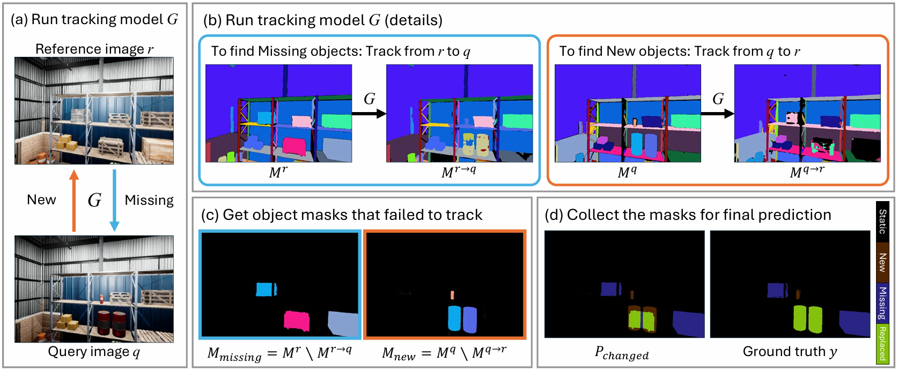

<div align="center">
  
# Zero-Shot Scene Change Detection
<h3><strong>AAAI 2025</strong></h3>

Kyusik Cho &emsp; Dong Yeop Kim &emsp; Euntai Kim  
Yonsei University

<a href='https://arxiv.org/abs/2406.11210'></a>


</div>
<hr />

**TL;DR:** We present a novel, training-free approach to scene change detection by leveraging a tracking model.

<p align="center">
  
</p>


## Prerequisites
### Pretrained Weights
* Download the DEVA weights from [this repository](https://github.com/hkchengrex/Tracking-Anything-with-DEVA).
* Download the SAM weights from [this repository](https://github.com/facebookresearch/segment-anything).
* Place the downloaded weights in the `model_weights` folder.

### Dataset Preparation 
Download the datasets and set the file structure as follows.  
Only the test dataset is required.  
Edit `dataset/path_config.py` to set the dataset directory path.

* [ChangeSim](https://github.com/SAMMiCA/ChangeSim)
```bash
ChangSim
├── Query
│   └── Query_Seq_Test
│       ├── Warehouse_6
│       │   ├── Seq_0
│       │   │   └── ...
│       │   └── Seq_1
│       │       └── ...
│       ├──  ...
│       │
│       └── Warehouse_8
│           ├── Seq_0
│           │   └── ...
│           └── Seq_1
│               └── ...
│
└── Ref
    └── Ref_Seq_Test
        ├── Warehouse_6
        │   ├── Seq_0
        │   │   └── ...
        │   └── Seq_1
        │       └── ...
        ├──  ...
        │
        └── Warehouse_8
            ├── Seq_0
            │   └── ...
            └── Seq_1
                └── ...
```

* VL-CMU-CD
```bash
VL-CMU-CD-binary255
└── test
    ├── t0
    ├── t1
    └── mask
```


* [PCD](https://kensakurada.github.io/pcd_dataset.html)
```bash
PCD
├── TSUNAMI
│   ├── t0
│   ├── t1
│   ├── ground_truth
│   └── mask
└── GSV
    ├── t0
    ├── t1
    ├── ground_truth
    └── mask
```


## Evaluation
* ChangeSim
```bash
$ python main.py
$ python main.py --changesim_subset dark
$ python main.py --changesim_subset dust
```

* VL_CMU_CD
```bash
$ python main.py --dataset VL_CMU_CD
```

* PCD
```bash
$ python main.py --dataset TSUNAMI
$ python main.py --dataset GSV
```

## Acknowledgements
Our pytorch implementation is based on the following projects and repos.
* [Segment Anything](https://github.com/facebookresearch/segment-anything)
* [DEVA](https://github.com/hkchengrex/Tracking-Anything-with-DEVA)
* [GCDSS](https://github.com/JethroPeng/GCDSS)


